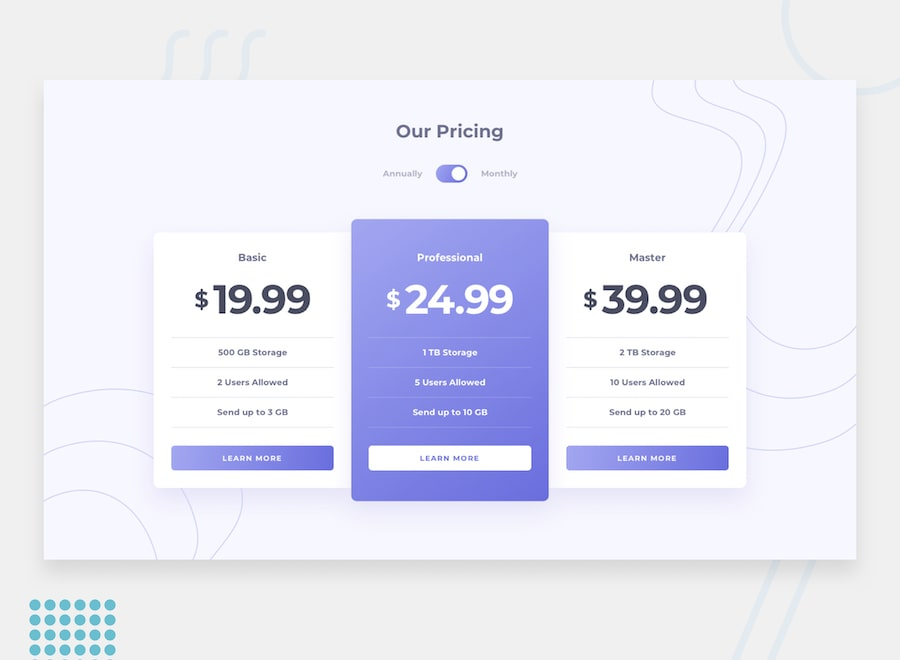

<h1 align="center">💳 Pricing Component with Toggle</h1>

<p align="center">
  Solução para o desafio <strong>Pricing Component with Toggle</strong> do
  <a href="https://www.frontendmentor.io">Frontend Mentor</a>.
</p>

<p align="center">
  <a href="https://social-component-toggler.vercel.app/">
    
  </a>
  <a href="https://www.frontendmentor.io/challenges/pricing-component-with-toggle-8vPwRMIC">
    
  </a>
  <a href="https://www.frontendmentor.io/profile/anaClarissi">
    
  </a>
  <a href="https://www.linkedin.com/in/anaclarissi">
    
  </a>
</p>

<p align="center">
  
</p>

---

## 📋 Índice

- [Visão geral](#-visão-geral)
- [O desafio](#-o-desafio)
- [Screenshot](#-screenshot)
- [Links](#-links)
- [Tecnologias utilizadas](#️-tecnologias-utilizadas)
- [Funcionalidades](#-funcionalidades)
- [O que aprendi](#-o-que-aprendi)
- [Melhorias futuras](#-melhorias-futuras)
- [Autora](#-autora)

---

## 🔎 Visão geral

Componente de precificação com um toggle (switch) que alterna os valores dos planos entre **anual** e **mensal**, construído a partir do design fornecido pelo Frontend Mentor, seguindo o style-guide oficial de cores, tipografia e responsividade.

## 🎯 O desafio

Os usuários devem ser capazes de:

- ✅ Visualizar o layout ideal do componente de acordo com o tamanho da tela do dispositivo
- ✅ Controlar o toggle tanto pelo mouse/trackpad quanto pelo teclado
- ✅ Ver os valores dos planos atualizados dinamicamente ao alternar entre anual/mensal

## 📸 Screenshot

<p align="center">
  
</p>

## 🔗 Links

| | |
|---|---|
| 🌐 **Live site** | [social-component-toggler.vercel.app](https://social-component-toggler.vercel.app/) |
| 🧩 **Desafio original** | [Frontend Mentor Challenge](https://www.frontendmentor.io/challenges/pricing-component-with-toggle-8vPwRMIC) |
| 👤 **Meu perfil FEM** | [frontendmentor.io/profile/anaClarissi](https://www.frontendmentor.io/profile/anaClarissi) |
| 💼 **LinkedIn** | [linkedin.com/in/anaclarissi](https://www.linkedin.com/in/anaclarissi) |

## 🛠️ Tecnologias utilizadas

<p>
  
  
  
  
  
  
</p>

- **HTML5 semântico** — estrutura acessível com `header`, `main` e uso correto de `label`/`input`
- **CSS3 + Sass** — variáveis customizadas para cores e gradientes, Grid e Flexbox para o layout responsivo
- **Bootstrap** — componentes base (`.card`, `.btn`, `.form-switch`) como ponto de partida, customizados via CSS próprio
- **JavaScript puro (Vanilla JS)** — lógica do toggle e atualização dinâmica dos valores dos planos
- **Vite** — bundler para desenvolvimento e build do projeto
- **Mobile-first workflow** com breakpoint dedicado para desktop (`min-width: 60em`)

## ⚙️ Funcionalidades

- 🔄 Alternância entre planos **anual** e **mensal** via `data-plan` no `<body>`
- ⌨️ Toggle 100% acessível por teclado (`Tab` + `Space`), usando `<input type="checkbox" role="switch">` nativo
- 📱 Layout responsivo: cards empilhados no mobile → grid de 3 colunas no desktop, com o plano "Professional" em destaque
- 🎨 Gradientes e cores fiéis ao style-guide oficial do desafio
- 🌀 Elementos decorativos de fundo posicionados de forma diferente entre mobile e desktop

## 💡 O que aprendi

Durante este desafio, pratiquei:

```js
// Atualização dinâmica dos valores com base no estado do toggle
function handlePlan() {
  const bodyDataPlan = swtichToggle.checked ? "monthly" : "annual";
  body.setAttribute("data-plan", bodyDataPlan);

  document.querySelectorAll(".card-item-plan").forEach((item) => {
    const planName = item.querySelector(".plan-value").id;
    item.querySelector(".plan-value").textContent = plan[bodyDataPlan][planName];
  });
}
```

- Uso de **atributos `data-*`** no `body` como fonte única de verdade para o estado da UI
- Construção de **grids responsivos** combinando Bootstrap com Grid/Flexbox customizados
- Posicionamento preciso de **múltiplos backgrounds** (`background-image` em camadas) para reproduzir os elementos decorativos do design
- Boas práticas de **acessibilidade** em controles do tipo switch/toggle

## 🚀 Melhorias futuras

- [ ] Adicionar animação de transição nos valores ao trocar de plano
- [ ] Extrair a lógica de dados dos planos para um arquivo JSON separado
- [ ] Escrever testes automatizados para a função `handlePlan()`
- [ ] Avaliar dark mode

## 👩‍💻 Autora

**Ana Clarissi**

- Frontend Mentor — [@anaClarissi](https://www.frontendmentor.io/profile/anaClarissi)
- LinkedIn — [anaclarissi](https://www.linkedin.com/in/anaclarissi)

---

<p align="center">Feito com 💜 por Ana Clarissi</p>